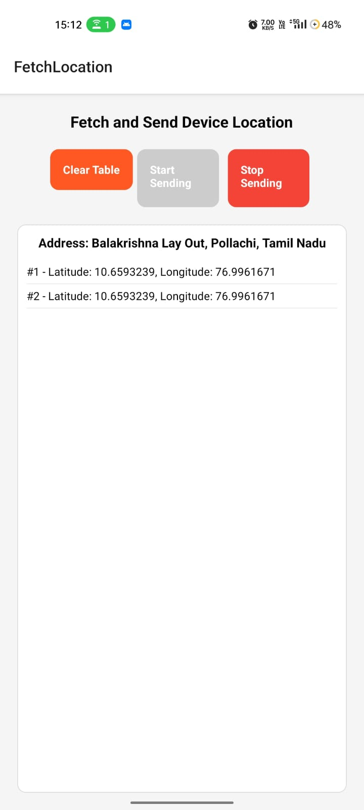
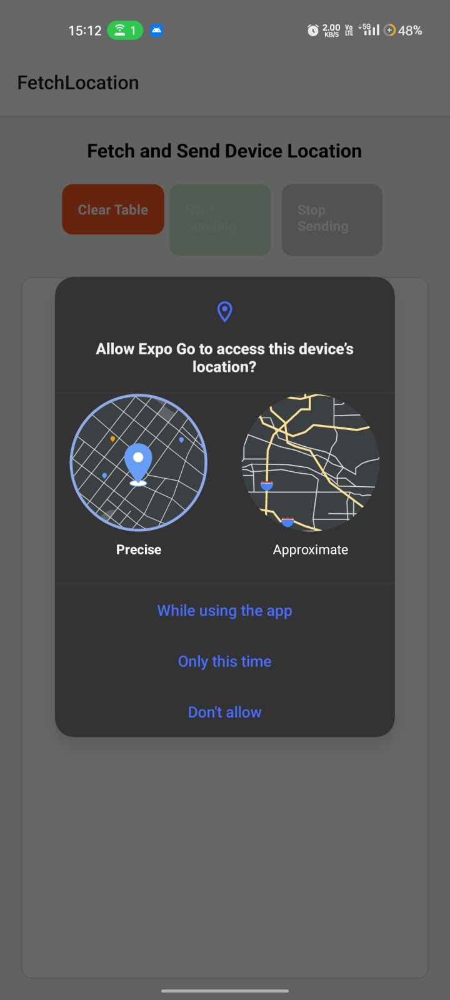

# Location App

This is a React Native application (built with Expo) that fetches the device's current location, displays it, and sends the coordinates to an ESP32 device over the local network. The app also allows you to view the last fetched location and clear the location history.


## Features
- Fetch device's current GPS location
- Reverse geocode to get a human-readable address
- Send latitude and longitude to an ESP32 server via HTTP POST
- View a list of sent locations
- Start/stop automatic location sending (every 5 seconds)
- Clear location history
- Simple navigation between screens

## App Screenshots
| App Main Screen | Working Proof |
|-----------------|--------------|
|  |  |

## Folder Structure
```
LOCATION-APP/
├── App.js                # Main app entry, navigation setup
├── index.js              # Expo entry point
├── app.json              # Expo configuration
├── package.json          # Project dependencies
├── assets/               # App icons and splash images
└── src/
    └── pages/
        ├── FetchLocation.js      # Main logic for fetching/sending location
        └── DisplayLocation.js    # Displays received location
```

## How It Works
- The app starts on the **FetchLocation** screen.
- When you tap **Start Sending**, the app requests location permissions, then fetches the device's location every 5 seconds.
- Each location is reverse-geocoded to an address and sent to the ESP32 server (update the IP in `FetchLocation.js`).
- You can stop sending at any time, or clear the location list.
- The **DisplayLocation** screen is set up for navigation and can be used to show a single location passed via navigation params.


## Setup & Usage
### 1. Install dependencies
```sh
npm install
```

### 2. Update ESP32 IP
- In `src/pages/FetchLocation.js`, set the `ESP32_IP` constant to your ESP32's local IP address.

### 3. Start the app
```sh
npx expo start
```
Or use:
```sh
npm run android   # For Android
npm run ios       # For iOS
npm run web       # For Web
```

### 4. View the app on your mobile device
- Install the **Expo Go** app from the [Google Play Store](https://play.google.com/store/apps/details?id=host.exp.exponent) or [Apple App Store](https://apps.apple.com/app/expo-go/id982107779).
- Scan the QR code shown in your terminal or browser after running `npm start`.

### 5. Grant location permissions when prompted.

## Dependencies
- [React Native](https://reactnative.dev/)
- [Expo](https://expo.dev/)
- [expo-location](https://docs.expo.dev/versions/latest/sdk/location/)
- [axios](https://axios-http.com/)
- [@react-navigation/native](https://reactnavigation.org/)
- [@react-navigation/stack](https://reactnavigation.org/docs/stack-navigator/)

## Notes
- The ESP32 must be on the same local network as your device.
- The app only sends latitude and longitude to the ESP32.
- For production, consider handling errors and permissions more robustly.

## License
MIT
